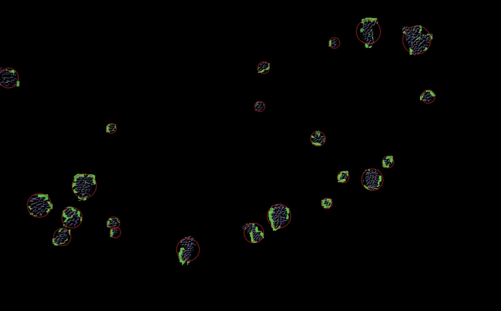

<!-- 
Author:     Garry Clawson
Date:       26th Jan 2022
Module:     CMP9767M Robotic Programming
Assignment: Assignment 1 - Grape Bunch Detection  
Version:    0.1.0  
Link:       https://github.com/garry-clawson/robot_programming

Comments:
As part of the presentation requirement I will be branching this repo and using the README.md file as a presentation area, with visuals and videos to present my project.  This will be on a FORK called ASSIGN_1_PRESENTATION. I will then merge this into the MAIN after the presentation has taken place. This will then allow other users to have much more detail about the project. I am noting this because you will see COMMITs after submission but prior to the presentation to the rep but only on the ASSIGN_1_PRESENTATION branch. The MAIN branch will be the submitted code base and README.md.
 -->

## Robot Programming CMP9767M

This repository contains the simulation of a vineyard with the challenge to count all the grape bunches across the vines. The specialist area for this project was around imaging and colour segmentation, where a pipeline of tools was used through OpenCV to identify the bunches. 

The navigation for this project uses a homing beacon system to get to a position, and the BUG2 algorithm to avoid any collisions as the robot traverses through the vineyard. A demonstration video is presented below showing how the Thorvald robot gets out of tight spaces to achieve a target goal point, from an initial constrained pose, for image taking.

https://user-images.githubusercontent.com/44243266/151281704-73a649ef-53f7-4e6f-acfe-41f06cd72c3c.mp4

## Pre-Condition's Required

TBC

## Route Planning Overview

The path planning uses the [BUG2 algorithm](https://automaticaddison.com/the-bug2-algorithm-for-robot-motion-planning/) and a homing beacon system to avoid collisions and get to required points for image taking. 

The algorithm is controlled by being in a series of states `LOOK_TOWARDS`, `GOAL_SEEK`, `WALL_FOLLOW`, `ROTATE_TO_VINES` and `HOMING_BEACON`.

1. `LOOK_TOWARDS` - This state rotates the robot towards the `HOMING_BEACON` which can be placed anywhere in the vineyard. Rather than use single end point I have used a series of these to act as points to take images at. Once pointed towards the beacon the robot state will be changed to `GOAL_SEEK`.

1. `GOAL_SEEK` - This moves the robot towards the goal (homing beacon) and if it encounters any obstacle it will change state to `WALL_FOLLOW`. The collision proximity params here are slightly larger than at `WALL_FOLLOW` so we can avoid getting closed into position. 

1. `WALL'_FOLLOW` - This state moves the robot out of a collision area and will keep going until it intersects with the BUG2 `GOAL"_SEEK` line. It will then move to state `LOOK_TOWARDS` to again go to the `HOMING_BEACON`

1. `ROTATE_TO"_VINES` - Once at the goal position, the robot will change state and rotate towards the vines ensuring that the KinectHD camera is facing the vines at 90 degrees (assumes the vine hedge is parallel to the perimeter wall - checks have shown it is)

1. `HOMING_BEACON` - The homing beacon brings the activities above together by giving them a target to move towards. This target is the location for an image to be taken, but could with little adjustment could be at the end of a vineyard, ensuring that the robot safely traverses all obstacles while running along vine rows towards its destination [*Note: BUG1 will fully traverse a full row and BUG2 will traverse up to the closest point tof the goal, then move off the wall/vine to the next one*]

1. `TAKE_IMAGE` - Once at the desired position we move to the `TAKE_IMAGE` state where the grape bunch counting process will begin.

Once we are at the correct position and angle to take an image the counting process takes over. 

## Grape Bunch Counting Process Overview

The grape bunch counting process is achieved through an imaging pipeline, using OpenCV, as follows:

1. `CV bridge`: This connects/links OpenCV to ROS
2. `cv2.cvtColor(image, cv2.COLOR_BGR2HSV)`: Convert to HSV image, apply thresholds then mask. A useful threshold tool is the [blob_detector.py](https://github.com/tizianofiorenzani/ros_tutorials/blob/master/opencv/include/blob_detector.py) by Tiziano Fiorenzani.
1. Repeat the above process but remove the green vines applying a new threshold
1. We now have an image with lots of smaller white dots. We need to remove this noise. We used `astype(np.uint8)` to convert to unit8, then `cv2.connectedComponentsWithStats(dummy_image, connectivity=8)` to build a list of centroids of all white dots. We then filter and remove any that are below 60 pixels in size (chosen via trial and error).
1. `cv2.dilate(vinemask_updated, np.ones((15, 15)), iterations = 1)` was used to [increase the size](https://opencv24-python-tutorials.readthedocs.io/en/latest/py_tutorials/py_imgproc/py_morphological_ops/py_morphological_ops.html) of the mask points. 
1. We then use `cv2.getStructuringElement(cv2.MORPH_ELLIPSE, (5,5))` to apply an elliptical shape to a following morphologyEx process
1. `cv2.morphologyEx(vinemask_updated, cv2.MORPH_OPEN, kernel)` to open the pixels to create larger centroid regions. The kernel size is critical here and we use 5,5. 7,7 opened up the image to far relative to distance image was being taken at and results were poor.

The following stage of the pipeline uses the `cv2.SimpleBlobDetector` to detect the grapes:

1. `cv2.copyMakeBorder(grape_bunch_mask, top=1, bottom=1, left=1, right=0, borderType= cv2.BORDER_CONSTANT, value=[255,255,255] )` to add a small border to the top, bottom, left but not the right hand side *(see Kinect Camera offset to Vines details for why)*
1. `cv2.SimpleBlobDetector_Params`, we add the required parameters. Some params are set as default so need ot be adjust to ensure we can identify the shapes of the grape bunches (and not just circles (circularity) for example). These params were discovered through trial and error across a range of images and lighting conditions, but only on 1 x compute resource. Deploying on alternative compute resources may require some amendment to these thresholds as well as HSV thresholds. 
1. `keypoints = detector.detect(grape_bunch_mask)`, creates a detector object and identifies keypoints in the image to our previously set params.
1. `cv2.drawKeypoints(image, keypoints, np.array([]), (000,000,255), cv2.DRAW_MATCHES_FLAGS_DRAW_RICH_KEYPOINTS)` draws the keypoints onto the image. There is a helper function within the file to save the any images to your local directory. 
1. The final step is the accumulation of the `keypoints` count. We do this for the images taken across the length of the vine and sum the total bunches (keypoints identified in each image) found for a total count of grape bunches. We display this to the terminal for the user.

### Perception Overview

HSV Image- Vineyard Small:

Keypoints Image - Vineyard Small:

HSV Image- Vineyard Stage 4 Small:

Keypoints Image - Vineyard Stage 4 Small:

### Root Programming - CMP9767M Grapevine Bunch Detection

https://docs.google.com/presentation/d/1FuE3A1aroXwpHDm40s5xWv4lMTm8JGdwhloraxSf0gE/edit?usp=sharing 

## Introduction to Problem

To detect and count the crop yield of a vine yard. This must be accomplished by navigating a Thorvald robot autonomously to count all grape bunches present in the vineyard. 

## Define my area of focus

My area of focus is perception of the grape bunches across the grapevine environment. This means developing a pipeline of tools that will enable detection of grape bunches with only limited variable adjustments rather than a new pipeline configuration or discovery mechanism. 

## What makes the problem hard

Several aspects of the challenge provided require consideration:

1. Occlusion

1. Lighting

1. Lighting direction

1. Colour Gradients of greens

1. Size of grapes

1. Variation on colour of grapes

1. Shadows

1. etc ...

## Explain My Approach to the Problem

Add images here to show results at each stage and discuss limitations and problems I come across

### State Update through the program

### BUG2

1. Explain what it is and why it was chosen over BUG0 or BUG1

1. Homing Beacons

1. Obstacle Avoidance (Wall Follow)

### Vision & OpenCV

1. simpleBlobDetector
1. MorhpologyEx
1. Dilation and Opening
1. Masking
1. etc ...

## Limitations of Solution

### Algorithm

1. Homing beacons require pre defining

1. Sensor (Hoyuka) can get stuck in tight corners or edges

1. Transition through states xcan get caught in a loop

1. Distance to grapevine and Hoyuka Field of View

1. etc ...

### Environment

1. Masking and HSV values

1. Terrain - only deal sin flat land

1. Odometry requirement

1. Use of external walls (not practical)

1. Laser density can go through Grapevine and cause reading errors

1. etc ....