<!-- 
Author:     Garry Clawson
Date:       26th Jan 2022
Module:     CMP9767M Robotic Programming
Assignment: Assignment 1 - Grape Bunch Detection  
Version:    0.1.0  
Link:       https://github.com/garry-clawson/robot_programming

Comments:
As part of the presentation requirement I will be branching this repo and using the README.md file as a presentation area, with visuals and videos to present my project.  This will be on a FORK called ASSIGN_1_PRESENTATION. I will then merge this into the MAIN after the presentation has taken place. This will then allow other users to have much more detail about the project. I am noting this because you will see COMMITs after submission but prior to the presentation to the rep but only on the ASSIGN_1_PRESENTATION branch. The MAIN branch will be the submitted code base and README.md.
 -->

## Robot Programming CMP9767M

This repository contains the simulation of a vineyard with the challenge to count all the grape bunches across the vines. The focus area for this project was image perception, where a pipeline of tools was used through OpenCV to accurately identify the grape bunches. 

The navigation for this project uses a homing beacon system to get to a position, and the BUG2 algorithm to avoid any collisions as the robot traverses through the vineyard. 

The key aspect of the project the was to complete the counting as accurately and as quickly as possible. With this in mind I opted to not localize or map the environment. Key characteristics are known upfront such as rows will run adjacent to one another, they will be bordered by a barrier and growing stages will be the same throughout the vineyard. 

A demonstration video is presented below showing how the Thorvald robot gets out of tight spaces to achieve a target goal point, from an initial constrained pose,to take an image of a grape vine. This is achieved by placing a homing_beacon at a required image point. Several homing_beacons can potentially be deployed to achieve as much coverage of the vine rows as required.

https://user-images.githubusercontent.com/44243266/151899734-6794c45a-fb0f-469b-b37a-3f39724f75e9.mp4

## Pre-Condition's Required

1. Crops to be laid out with a gap of at least 4 meters between each row - this is due to the size of the robot (for rotation and positioning requirements) but also ensuring images are not cropped at the top or bottom of vine.

1. Orientation of the crops can be in either in the longitudinal or horizontal direction, as long as the `HOMING_BEACON` points are positioned 2m from the vine hedge (to ensure images are not cropped).

1. Odometry messages are subscribed to, to maintain the orientation of the Thorvald. Testing across the multiple worlds has shown few repeatability (variance of circa 5%) issues when taking images and counting the grape bunches. However, in some instances, creep (robot edges to one side) has been shown effect the results as some grape bunches can drop off the image.

1. The perimeter wall is required as the program utililises the BUG2 wall follower algorithm for obstacle avoidance.

1. Detection of different growth stages throughout a single vineyard is not implemented in this solution. Stage 0 vines are also not yet able to be detected due to their size and colouring. 

## Route Planning Overview

Path planning uses the [BUG2 algorithm](https://automaticaddison.com/the-bug2-algorithm-for-robot-motion-planning/) and a homing beacon system to avoid collisions and get to required points for image taking. 

The systems is controlled by utlising in a series of states `LOOK_TOWARDS`, `GOAL_SEEK`, `WALL_FOLLOW`, `ROTATE_TO_VINES` and `HOMING_BEACON`. The robot can only be one state at any one time. Alternation between states creates the robot activity.

### State Review

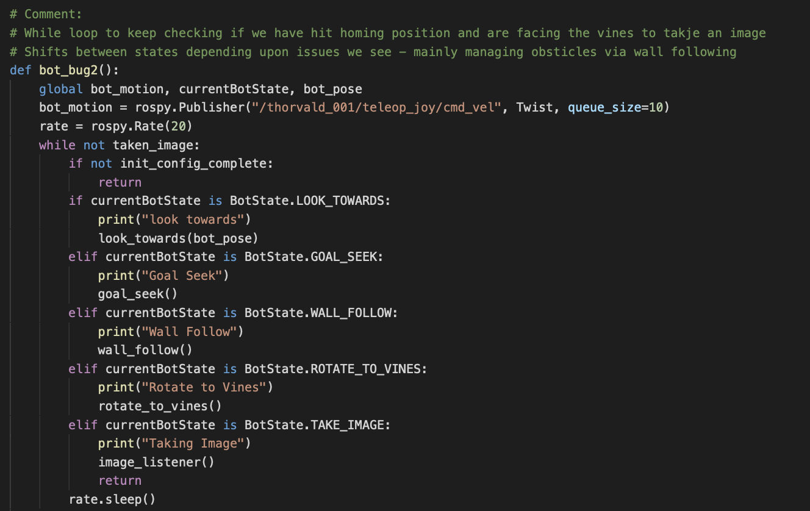

- `LOOK_TOWARDS` - This state rotates the robot towards the `HOMING_BEACON` which can be placed anywhere in the vineyard. Rather than use single end point I have used a series of these to act as points to take images at. Once pointed towards the beacon the robot state will be changed to `GOAL_SEEK`.

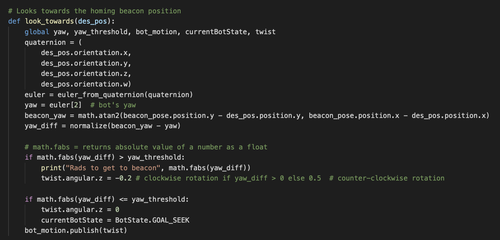

- `GOAL_SEEK` - This moves the robot towards the goal (homing beacon) and if it encounters any obstacle it will change state to `WALL_FOLLOW`. The collision proximity params here are slightly larger than at `WALL_FOLLOW` so we can avoid getting closed into position. 

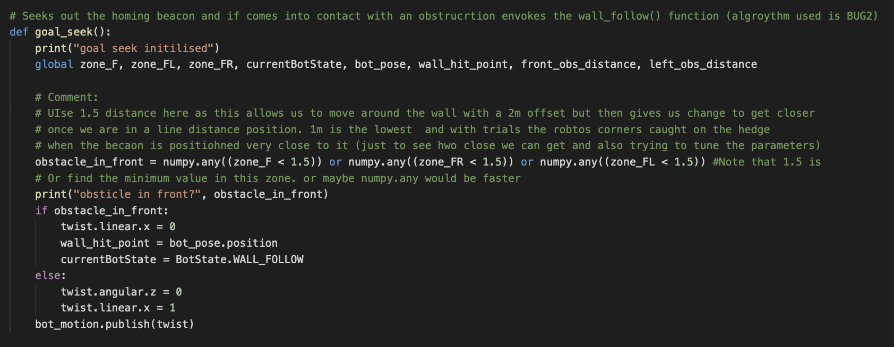

- `WALL_FOLLOW` - This state moves the robot out of a collision area and will keep going until it intersects with the BUG2 `GOAL"_SEEK` line. It will then move to state `LOOK_TOWARDS` to again go to the `HOMING_BEACON`

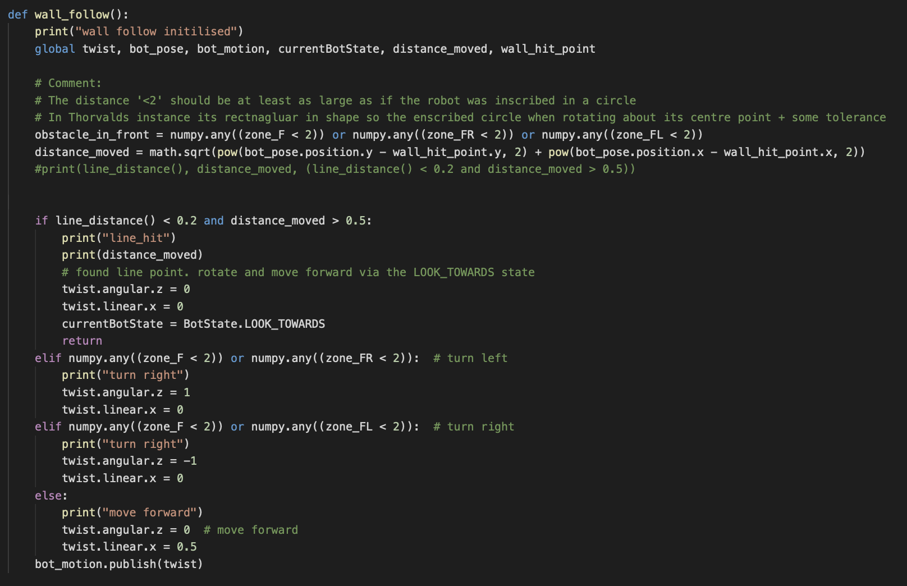

- `ROTATE_TO_VINES` - Once at the goal position, the robot will change state and rotate towards the vines ensuring that the KinectHD camera is facing the vines at 90 degrees (assumes the vine hedge is parallel to the perimeter wall - checks have shown it is)

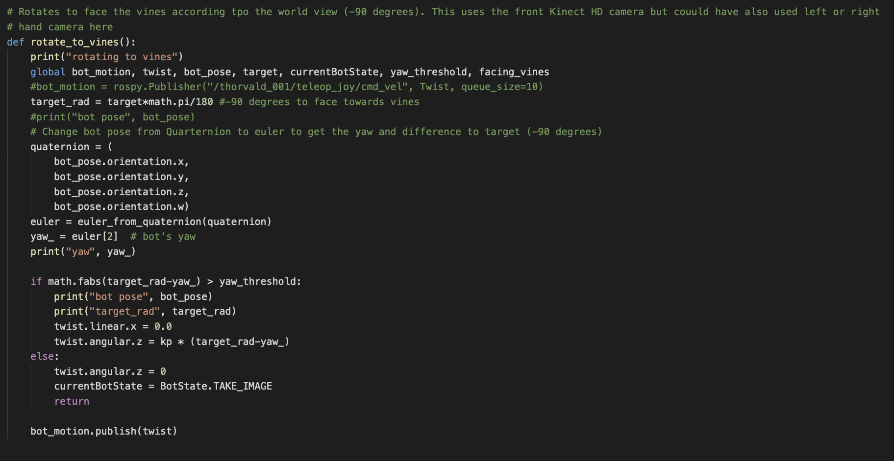

- `HOMING_BEACON` - The homing beacon brings the activities above together by giving them a target position to move towards. This publishes the `PoseStamped.msg` for subscription. This target currently being the location for an image to be taken. However, amending this target to be at the end of a vineyard, the robot could safely traverses all obstacles while running along vine rows towards its destination taking images governed by odometry or Lidar positioning constraints [*Note: BUG1 will fully traverse a full row and BUG2 will traverse up to the nearest leave point for the goal, then move off the wall/vine to towards its target.*]

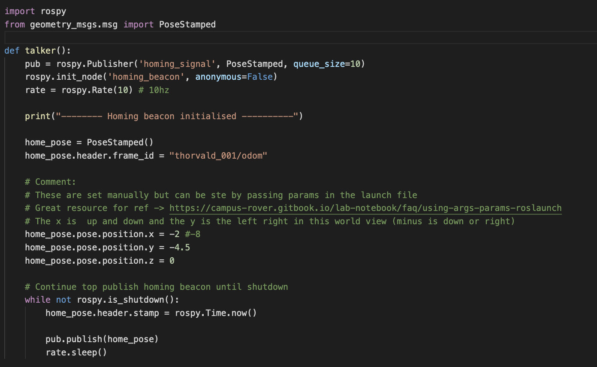

 - `TAKE_IMAGE` - Once at the desired position we move to the `TAKE_IMAGE` state where the grape bunch counting process will begin.

Once we are at the correct position and angle to take an image the counting process takes over. 

## Grape Bunch Counting Process Pipeline

The grape bunch counting process is achieved through an imaging pipeline, using OpenCV. There are two stages, the first being to mask the required grape bunches, then the second being to detect the masked features. The pipeline is summarized below with an example for each stage of the process shown below:

*Note: Read L->R*

  
   
   

  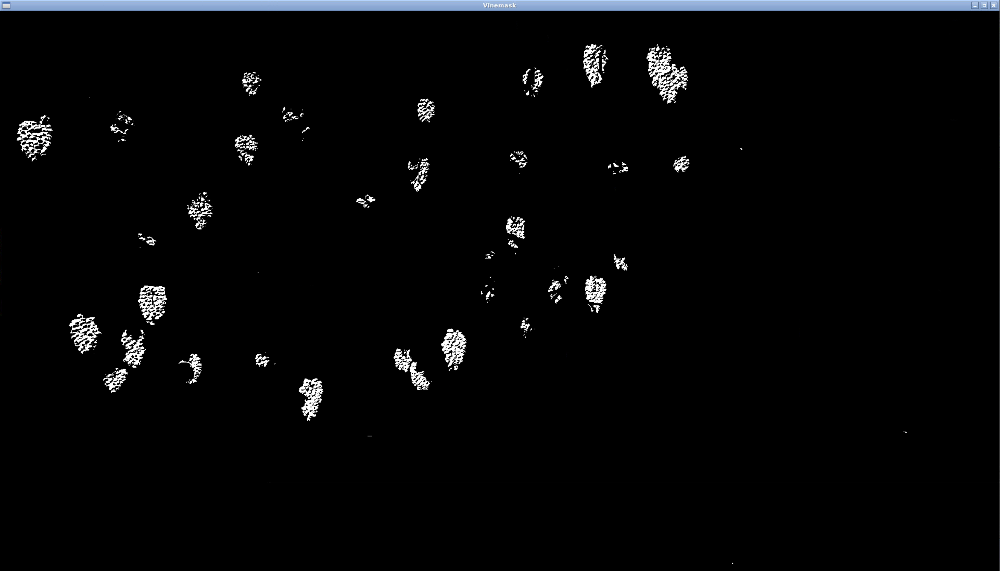
   
   

  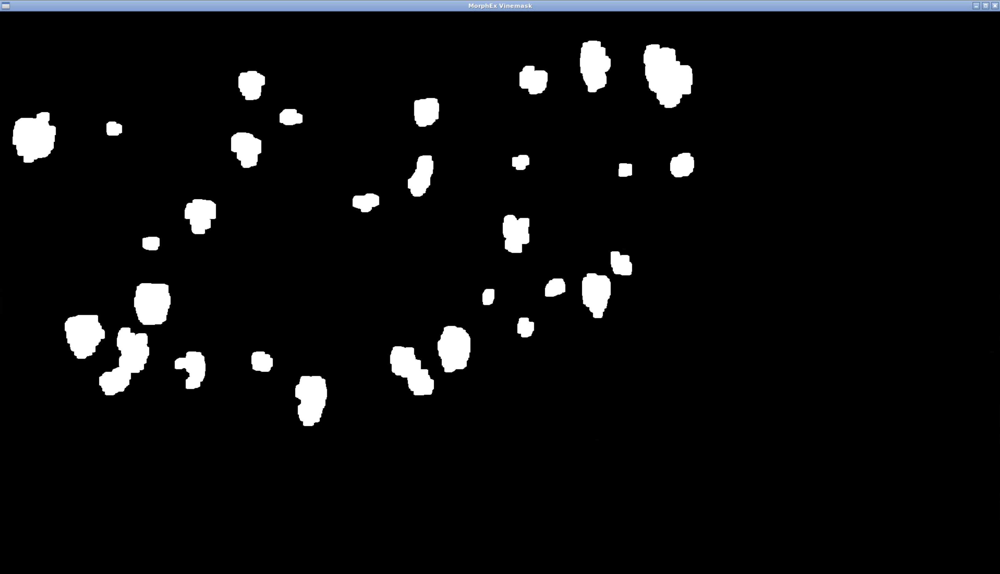
   
   

#### The masking process stage of the pipeline to remove non needed components

1. `CV bridge`: This connects/links OpenCV to ROS
1. `cv2.cvtColor(image, cv2.COLOR_BGR2HSV)`: Convert to HSV image, apply thresholds using `cv2.inRange()` then mask. A useful threshold tool is the [blob_detector.py](https://github.com/tizianofiorenzani/ros_tutorials/blob/master/opencv/include/blob_detector.py) by Tiziano Fiorenzani.
1. Repeat the above process but remove the green vines applying a new threshold
1. We now have an image with lots of smaller white dots. We need to remove this noise. We used `astype(np.uint8)` to convert to unit8, then `cv2.connectedComponentsWithStats(dummy_image, connectivity=8)` to build a list of centroids of all white dots. We then filter and remove any that are below 60 pixels in size (chosen via trial and error).
1. `cv2.dilate(vinemask_updated, np.ones((15, 15)), iterations = 1)` was used to [increase the size](https://opencv24-python-tutorials.readthedocs.io/en/latest/py_tutorials/py_imgproc/py_morphological_ops/py_morphological_ops.html) of the mask points. 
1. We then use `cv2.getStructuringElement(cv2.MORPH_ELLIPSE, (5,5))` to apply an elliptical shape to a following morphologyEx process
1. `cv2.morphologyEx(vinemask_updated, cv2.MORPH_OPEN, kernel)` to open the pixels to create larger centroid regions. The kernel size is critical here and we use 5,5. 7,7 opened up the image to far relative to the distance the image was being taken at and results were poor.

  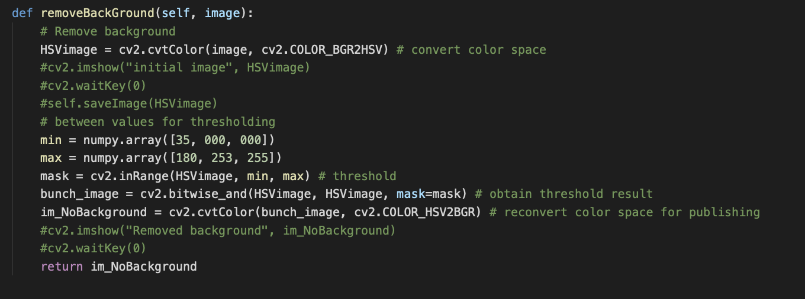
   

#### The following stage of the pipeline uses the `cv2.SimpleBlobDetector` to detect the grapes:

1. `cv2.copyMakeBorder(grape_bunch_mask, top=1, bottom=1, left=1, right=0, borderType= cv2.BORDER_CONSTANT, value=[255,255,255] )` to add a small border to the top, bottom, left but not the right hand side *(see Kinect Camera offset to Vines details for why)*
1. `cv2.SimpleBlobDetector_Params`, we add the required parameters. Some params are set as default so need ot be adjust to ensure we can identify the shapes of the grape bunches (and not just circles (circularity) for example). These params were discovered through trial and error across a range of images and robot placements, but only on 1 x compute resource. 
1. `keypoints = detector.detect(grape_bunch_mask)`, creates a detector object and identifies keypoints in the image to our previously set params.
1. `cv2.drawKeypoints(image, keypoints, np.array([]), (000,000,255), cv2.DRAW_MATCHES_FLAGS_DRAW_RICH_KEYPOINTS)` draws the keypoints onto the image. There is a helper function within the file to save the any images to your local directory. 
1. The final step is the accumulation of the `keypoints` count. We do this for the images taken across the length of the vine and sum the total bunches (keypoints identified in each image) found for a total count of grape bunches. We display this to the terminal for the user.

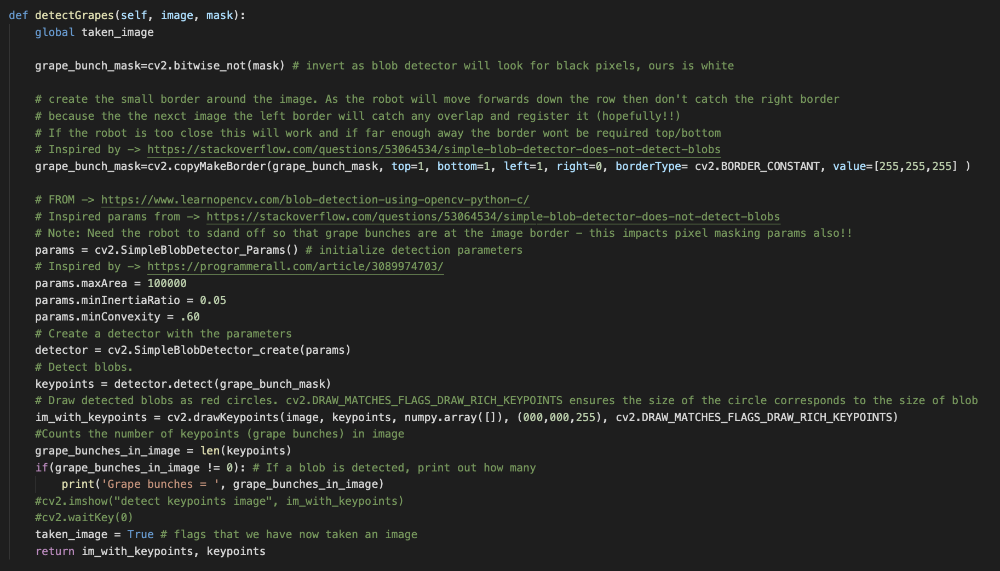

### Further Grapevine Bunch Images from across Different Worlds

*HSV Image (Vineyard Small) and Keypoints Image (Vineyard Small):*

  
   

*HSV Image (Vineyard Stage 4 Small) and Keypoints Image (Vineyard Stage 4 Small):*

  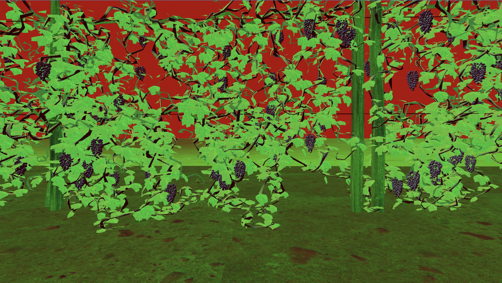
  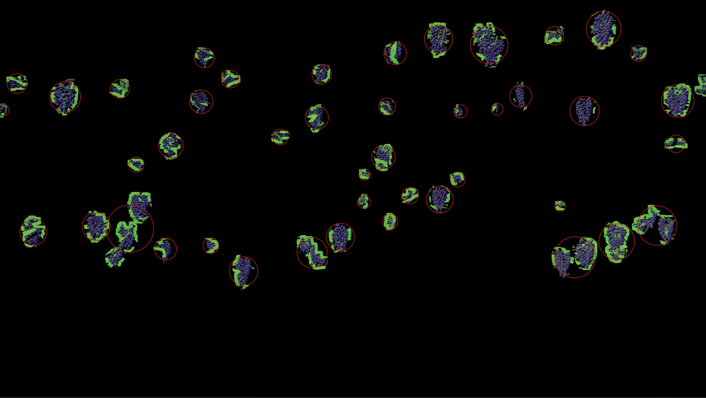 

- <b>Note:</b> It can be seen that the LHS border grape bunch is not identified. This is due to the border constraint applied in the `cv2.SimpleBlobDetector` process, as this object would have been detected on a previously taken image as the robot traversed to homing_beacon points positioned along the row. 

## Reflections on Solution

To roll out this solution to a real world environment the following considerations would need to take place. 

### Physical

1. <b>Transition from odometry to lidar based navigation</b> - for squaring up we could check angles (say 15 degrees either side of closest  contact point) to identify if they are the same value. If they are then the robot is square, if not, then rotate accordingly.  

1. <b>Lidar scans</b> - I utilised a wall following technique using Lidar. I reduced the field of View and tried to increase the density of the scan over a shorter field. However, scan points will traverse through the hedge making lidar unpredictable if wall following a vine row. Physical markers may be required within the environment. 

1. <b>Front facing camera</b> - The front facing camera was deployed however constantly rotating the robot towards the vine would cause divots in the surrounding ground area. GThis would, over time, impact positioning and eventually imaging. Utilizing the side facing cameras could reduce this issue. 

1. <b>Multi-robot</b> - The system is not yet suitable for multi-robot systems. Seperate arena's would be required at the current stage of development. The messaging would need to be improved and subscriptions managed to ensure robots did not repeat tasks. 

https://user-images.githubusercontent.com/44243266/151898192-6909ea82-058c-485f-96d0-fdc5cb6c976e.mov

### Software Concept

1. <b>State system</b> - Several scenarios can bring about the state system getting caught in a loop and never leaving to goal_seek.  

1. <b>SimpleBlobDetector</b> - I would have focused efforts onto detecting the actual berries using their features that are not dependent upon their colour. Aspects such as curve and shape could have been used to transition against a leaf or identifying other berries around them (i.e. the bunch). 

1. <b>homing_beacons</b> - The homing_beacons concept initially resolved speed issues however as the field grows time to create a suitable homing_beacon map of could have been spent by the robot performing SLAM or localising through a grid of way_points.

1. <b>wall_follow</b> - The obstacle avoidance process was married with the wall_follow state. However, this meant that extra time was taken navigating the perimeter of the vineyard. This could force the system to get into a loop where the robot could not escape or areas become inaccessible as it would never navigate to these points unless co-opted.

1. <b>masking</b> - Masking was extremely useful, however this assumed constant conditions. Case-Switch statements could offer various code paths (or taking params out of a launch file), however these would at best be averages. Updating the system to detect features other than colour would offer improved counting performance across seasonality, weather or lighting conditions. 

