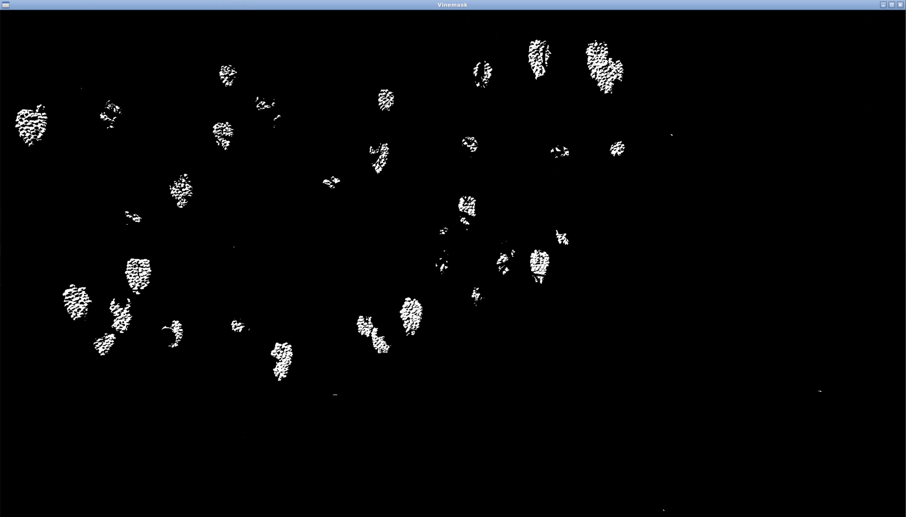
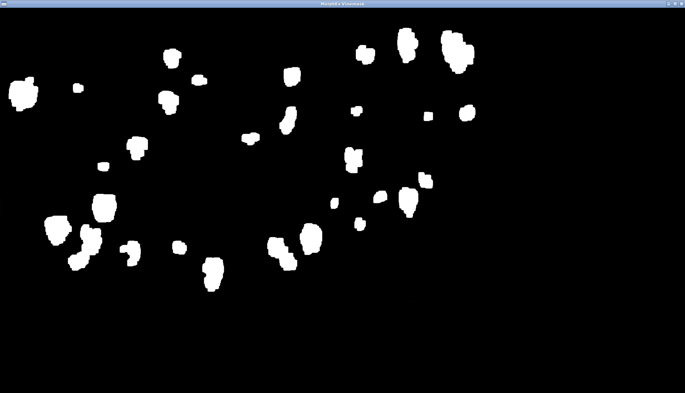

<!-- 
Author:     Garry Clawson
Date:       26th Jan 2022
Module:     CMP9767M Robotic Programming
Assignment: Assignment 1 - Grape Bunch Detection  
Version:    0.1.0  
Link:       https://github.com/garry-clawson/robot_programming

Comments:
As part of the presentation requirement I will be branching this repo and using the README.md file as a presentation area, with visuals and videos to present my project.  This will be on a FORK called ASSIGN_1_PRESENTATION. I will then merge this into the MAIN after the presentation has taken place. This will then allow other users to have much more detail about the project. I am noting this because you will see COMMITs after submission but prior to the presentation to the rep but only on the ASSIGN_1_PRESENTATION branch. The MAIN branch will be the submitted code base and README.md.
 -->


## Robot Programming CMP9767M

This repository contains the simulation of a vineyard with the challenge to count all the grape bunches across the vines. The specialist area for this project was around imaging and colour segmentation, where a pipeline of tools was used through OpenCV to identify the bunches. 

The navigation for this project uses a homing beacon system to get to a position, and the BUG2 algorithm to avoid any collisions as the robot traverses through the vineyard. A demonstration video is presented below showing how the Thorvald robot gets out of tight spaces to achieve a target goal point, from an initial constrained pose, for image taking.

https://user-images.githubusercontent.com/44243266/151899734-6794c45a-fb0f-469b-b37a-3f39724f75e9.mp4

## Set Up Your System

The following are the steps required to run and launch this project. You will need a GitHub account for best management of your files and also be familiar with the Git command lines tools and terminal. You will need Ubuntu 18.04 to run this project due to ROS requirements.

1. Make sure your system is upto date by running `sudo apt-get update && sudo apt-get upgrade`

1. Fork the `LCAS/CMP9767M` project from [https://github.com/LCAS/CMP9767M](https://github.com/LCAS/CMP9767M) as described in the [LCAS Wiki](https://github.com/LCAS/CMP9767M/wiki/Workshop-1---Introduction-and-ROS-Basics)

1. Install the following packages:

```
sudo apt-get install \
    ros-melodic-opencv-apps \
    ros-melodic-rqt-image-view \
    ros-melodic-uol-cmp9767m-base \
    ros-melodic-find-object-2d \
    ros-melodic-video-stream-opencv \
    ros-melodic-topic-tools \
    ros-melodic-rqt-tf-tree
    ros-melodic-opencv-apps \
    ros-melodic-rqt-image-view \
    ros-melodic-image-geometry \
    ros-melodic-uol-cmp9767m-base \
    ros-melodic-uol-cmp9767m-tutorial \
    ros-melodic-find-object-2d \
    ros-melodic-video-stream-opencv \
    ros-melodic-image-view
    ros-melodic-robot-localization \
    ros-melodic-thorvald \
    ros-melodic-velodyne-description \
    ros-melodic-kinect2-description \
    ros-melodic-topological-navigation \
    ros-melodic-teleop-tools \
    ros-melodic-amcl
    ros-melodic-robot-localization \
    ros-melodic-topological-navigation \
    ros-melodic-amcl \
    ros-melodic-fake-localization \
    ros-melodic-carrot-planner
    ros-melodic-topological-utils \
    ros-melodic-topological-navigation \
    ros-melodic-topological-navigation-msgs \
    ros-melodic-strands-navigation
```
You should then source your terminal by running:

`source /opt/ros/melodic/setup.bash`

*Note: You can also add this to your '~/.bashrc' file by pasting the above commend at the bottom. This will automatically configure the source for each new terminal you are starting. Within ROS you can have upwards of 5-7 terminals open at once, so this is very useful.*

1. Create a catkin_ws by following the fantastic [ROS catkin tutorials](http://wiki.ros.org/catkin/Tutorials/create_a_workspace)

1. Copy the `LCAS/CMP9767M` project from step 1 into the `/src` folder of your new workspace (`catkin_ws/src`)

1. Create a folder called `grape_bunch_counter` within your `catkin_ws/src` folder. Fork the contents of this [robot_programming](https://github.com/garry-clawson/robot_programming) repository and clone into the `grape_bunch_counter` folder (this will be your *package* for the project). *Note: The `images` folder is not required and can be deleted and is only used for this README.md document.* 

1. Now you have all the files you require to run the project. We need to complete the `catkin_make` process. To do this `roscd` to get the head of the files, then `cd ..` out of the `devel` folder. You should now be in the `catkin_ws` folder.  Use `catkin_make` to build your project.

1. A nice way to see if this has been successfull is to type `roslaunch` then double tab and you should see the package, `grape_bunch_counter`, as an option. Another double tab should then show, `grape_bunch_counter.launch`.


### Update Hokuyo Sensor Profile

The front and back sensor is use the Hokuya laser. This is set to min and max capability and gives an uneven range around the robot, especially if you divide the sensor laser scan into zones for LEFT, LEFTFRONT, FRONT and so on. The laser is also 45 degrees offset. To adjust this, update the `sensor_hokuyo_laser.xacro` file found in `src/bacchus_lcas/bacchus_gazebo/urdf/bacchus_sensors.xaxro` and change line 21, 22 and 29,30 to:

`min_angle="-0.7854"`

`max_angle="2.3562"`

This will update the laser to scan across a -180 to 180 field of view. You will still have 720 laser data points to work with. 

### Update Thorvald Spawn Point (Optional)

To demonstrate the navigation aspects and collision avoidance, the spawn points for Thorvald can be amended to behind the vine hedge. This can be done be updating the values on lines 36 and 37 in file `src/bacchus_lcas/bacchus_gazebo/urdf/launch/vineyard_demo.launch` to the following:

`<arg name="X_INIT" value="-10.0" unless="$(arg riseholme_dt)"/>`

`<arg name="Y_INIT" value="-10.0" unless="$(arg riseholme_dt)"/>`

This will position the Thorvald robot in the bottom right hand corner near two wall edges and the bottom of the vineyard as per the demonstration video above.

## How to launch the Project

To launch the robot, type the following in the terminal:

1. `roslaunch grape_bunch_counter grape_bunch_counter.launch`

1. `rosrun grape_bunch_counter homing_beacon.py`

This will call the package and associated launch and .py files. The `homing_beacon.py` file is required to start a few seconds after the launch file to ensure that the sensors in Gazebo are fully initialized and the robot is taking readings. The launch file itself is very simple and consists of two simple components along with additional launch parameters:

- The node details for the relevent .py files

- An <include> which finds the bacchus_gazebo vineyard demo launch (launches the vineyard_small as default)


## Grape Bunch Counting Process Overview

The grape bunch counting process is achieved through an imaging pipeline, using OpenCV, as follows:

1. `CV bridge`: This connects/links OpenCV to ROS
2. `cv2.cvtColor(image, cv2.COLOR_BGR2HSV)`: Convert to HSV image, apply thresholds then mask. A useful threshold tool is the [blob_detector.py](https://github.com/tizianofiorenzani/ros_tutorials/blob/master/opencv/include/blob_detector.py) by Tiziano Fiorenzani.
1. Repeat the above process but remove the green vines applying a new threshold
1. We now have an image with lots of smaller white dots. We need to remove this noise. We used `astype(np.uint8)` to convert to unit8, then `cv2.connectedComponentsWithStats(dummy_image, connectivity=8)` to build a list of centroids of all white dots. We then filter and remove any that are below 60 pixels in size (chosen via trial and error).
1. `cv2.dilate(vinemask_updated, np.ones((15, 15)), iterations = 1)` was used to [increase the size](https://opencv24-python-tutorials.readthedocs.io/en/latest/py_tutorials/py_imgproc/py_morphological_ops/py_morphological_ops.html) of the mask points. 
1. We then use `cv2.getStructuringElement(cv2.MORPH_ELLIPSE, (5,5))` to apply an elliptical shape to a following morphologyEx process
1. `cv2.morphologyEx(vinemask_updated, cv2.MORPH_OPEN, kernel)` to open the pixels to create larger centroid regions. The kernel size is critical here and we use 5,5. 7,7 opened up the image to far relative to distance image was being taken at and results were poor.

The following stage of the pipeline uses the `cv2.SimpleBlobDetector` to detect the grapes:

1. `cv2.copyMakeBorder(grape_bunch_mask, top=1, bottom=1, left=1, right=0, borderType= cv2.BORDER_CONSTANT, value=[255,255,255] )` to add a small border to the top, bottom, left but not the right hand side *(see Kinect Camera offset to Vines details for why)*
1. `cv2.SimpleBlobDetector_Params`, we add the required parameters. Some params are set as default so need ot be adjust to ensure we can identify the shapes of the grape bunches (and not just circles (circularity) for example). These params were discovered through trial and error across a range of images and lighting conditions, but only on 1 x compute resource. Deploying on alternative compute resources may require some amendment to these thresholds as well as HSV thresholds. 
1. `keypoints = detector.detect(grape_bunch_mask)`, creates a detector object and identifies keypoints in the image to our previously set params.
1. `cv2.drawKeypoints(image, keypoints, np.array([]), (000,000,255), cv2.DRAW_MATCHES_FLAGS_DRAW_RICH_KEYPOINTS)` draws the keypoints onto the image. There is a helper function within the file to save the any images to your local directory. 
1. The final step is the accumulation of the `keypoints` count. We do this for the images taken across the length of the vine and sum the total bunches (keypoints identified in each image) found for a total count of grape bunches. We display this to the terminal for the user.

### Kinect Camera offset to Vines

The distance to the vines is correlated to the field of view of the Kinect_v2 camera. This information can be found in the `src/bacchus_lcas/bacchus_gazebo/urdf/sensors/sensor_kinect_v2_.xaxro` file on line 109. This gives us a value of `<horizontal_fov>${84.1*3.14/180.0}</horizontal_fov>` which is around 1.467 rads for the viewing angle. The length of the vine hedge in the 'world_name:=vineyard_small' is 12 meters (found from visual inspection). At 2m from the hedge we will image 3.60794m of the hedge with the available field of view. Taking an image of the full vine hedge at 2m distance therefore requires 12 / 3.61 = 3.32 images. Or rather the last image will only have 1/3rd of the vine hedge on (if we take an image directly at the start of the hedge with the RHS at the border of the image). We need to be careful that we don't crop the top of the hedge if we are too close.

The images are taken from right through left. As part of the process we use `cv2.SimpleBlobDetector`. The simple blob detector ignores keypoints on the boundary so a border was created with the right side of the border removed (so anything on the RHS would not be counted if it fell on the this line). As the robot moves down the vine row, anything missed out on the RHS is captured on the LHS image. This avoids the issue of double counting boundary grape bunches as long as we are careful with our positioning; however robot distance to hedge and camera FoV should be as accurate as possible to get sensible results.

### Image Pipeline for Grape Bunch Counting
 
*Note: Read L->R*

<p float="left">
  
   
   
</p>

<p float="left">
  
   
   
</p>

<p float="left">
  
   
   
</p>

## Route Planning Overview

The path planning uses the [BUG2 algorithm](https://automaticaddison.com/the-bug2-algorithm-for-robot-motion-planning/) and a homing beacon system to avoid collisions and get to required points for image taking. 

The algorithm is controlled by being in a series of states `LOOK_TOWARDS`, `GOAL_SEEK`, `WALL_FOLLOW` and `ROTATE_TO_VINES`. 

1. `LOOK_TOWARDS` - This state rotates the robot towards the `HOMING_BEACON` which can be placed anywhere in the vineyard. Rather than use single end point I have used a series of these to act as points to take images at. Once pointed towards the beacon the robot state will be changed to `GOAL_SEEK`.

1. `GOAL_SEEK` - This moves the robot towards the goal (homing beacon) and if it encounters any obstacle it will change state to `WALL_FOLLOW`. The collision proximity params here are slightly larger than at `WALL_FOLLOW` so we can avoid getting closed into position. 

1. `WALL'_FOLLOW` - This state moves the robot out of a collision area and will keep going until it intersects with the BUG2 `GOAL"_SEEK` line. It will then move to state `LOOK_TOWARDS` to again go to the `HOMING_BEACON`

1. `ROTATE_TO"_VINES` - Once at the goal position, the robot will change state and rotate towards the vines ensuring that the KinectHD camera is facing the vines at 90 degrees (assumes the vine hedge is parallel to the perimeter wall - checks have shown it is)

1. `TAKE_IMAGE` - Once at the desired position we move to the `TAKE_IMAGE` state where the grape bunch counting process will begin.

Once we are at the correct position and angle to take an image the counting process takes over. 
